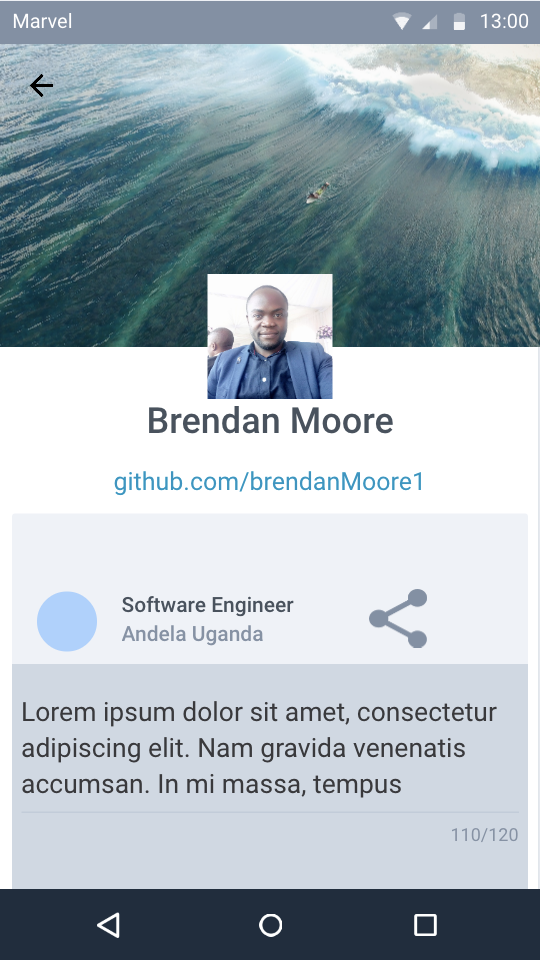
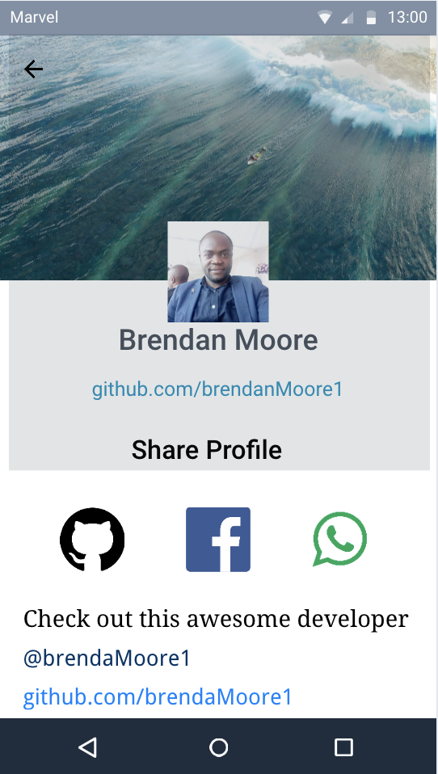

## Badges

# Build an Android app to retrieve a list of Java Developers in Nairobi using the Github API (Links to an external site.)Links to an external site.

### Mockups/Wireframe

For the mockup design, I used an online site called [marvelapp](https://marvelapp.com/). 
I chose this resource because:
- It is easy to use and comes with preset views which make the designing process fast
- It is also easier to share the mockups using such online resources as compared to the offline ones
- The online site also allows me to work on the mockup wherever I am using any computer that I choose to use

[Link to Mockups](https://marvelapp.com/gjd68cj/screen/54658244)

